# Greenwood's Arborist Services
Greenwood's Arborist Services is a tree surgery company based in South West London, England.

The client Sam Greenwood had been working for another tree surgery company for the past 10 years. Over the past few months, he has decided to start up his own business and work for himself alongside other tree surgeons he has met throughout his career.

[Click here to go to the live website!](https://et9719.github.io/GreenwoodAS/)

## Table of contents

1. [Client Expectations](#client-expectations)
2. [User Expectations](#user-expectations)
3. [Wireframes](#wireframes)
    - [Home](#home)
    - [Services](#services)
    - [Contact Us](#contact-us)
4. [Features](#features)
    - [Navigation Bar](#navigation-bar)
    - [The Landing Page Image](#the-landing-page-image)
    - [About Us Section](#about-us-section)
    - [Meet The Team Section](#meet-the-team-section)
    - [Gallery Section](#gallery-section)
    - [Services Page](#services-page)
    - [Contact Us Page](#contact-us-page)
    - [Footer](#footer)
5. [Extra Features](#extra-features)
    - [Nav bar on mobile version](#nav-bar-on-mobile-version)
    - [Video](#video)
6. [Testing](#testing)
    - [HTML](#html)
    - [CSS](#css)
7. [Deployment](#deployment)
8. [Credits](#credits)
    - [Content](#content)
    - [Media](#media)

## Client Expectations

Features the client wants on the website:

- Details of the areas that the company works in.
- A section for customers to get to know greenwoods team members.
- photos of previous work done by the company.
- A list of all the services the company can provide.
- A form for clients to contact Greenwoods services.

The client wants the website to be easy to use as they often get older clients, so the site should be simple and easy to work your way around, not over complicated.

## User Expectations

- As a user, I want to be able to easily navigate through the website.
- As a user, I want to see the staff before they arrive at my property to do a job, so I have a   better idea of who I am inviting into my home.
- As a user, I want to see the quality of their work before booking them to do a job.
- As a user, I want to easily see if they can offer the service I'm looking for. 
- As a user, I want to be able to easily get in contact with the company to book a job.

## Wireframes

### Home 

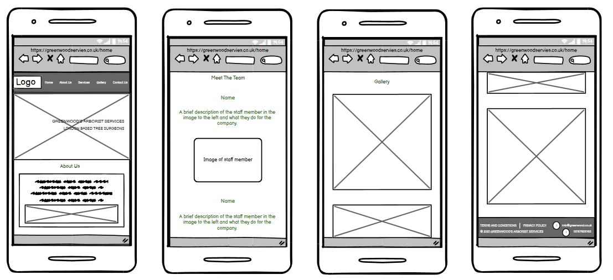

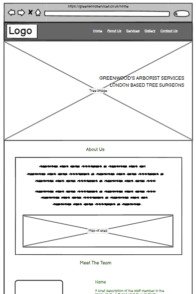
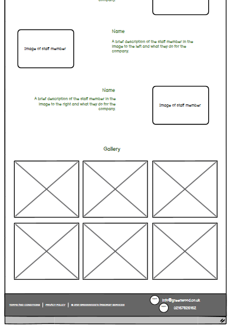

### Services 

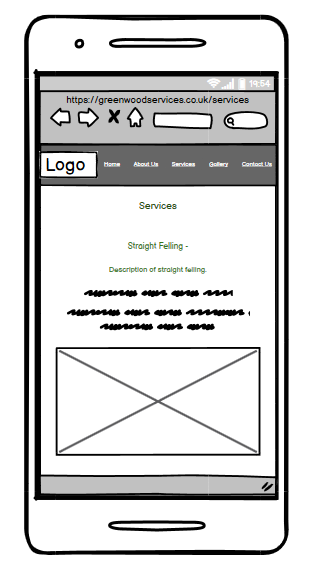

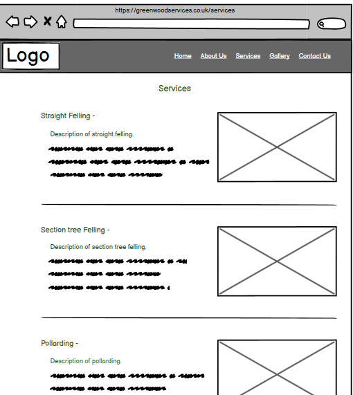

### Contact Us 

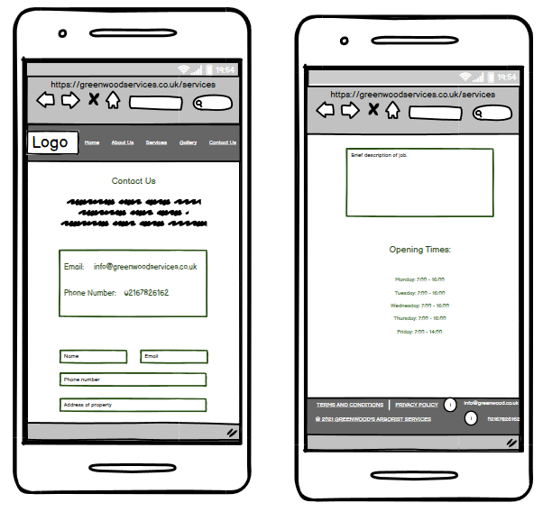

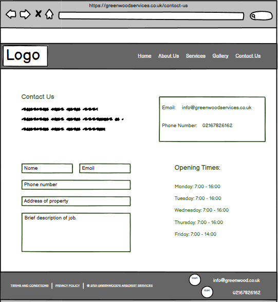

## Features

### Navigation Bar

- The Navigation bar is fully responsive and identical on all three pages this helps give the site a common theme.

- The company logo is also part of the navigation bar, this also acts as a link back to the home page.

- The home page has multiple sections, so the navigation bar has links to the 'About Us' and 'Gallery' sections on the home page to make them easier to find.

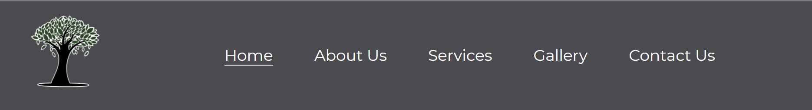

### The Landing Page Image

- The landing page image with overlay text is there to introduce the user to the company 

- the overlay text also states that the company is London based so users are aware of the area in which the company operate. 

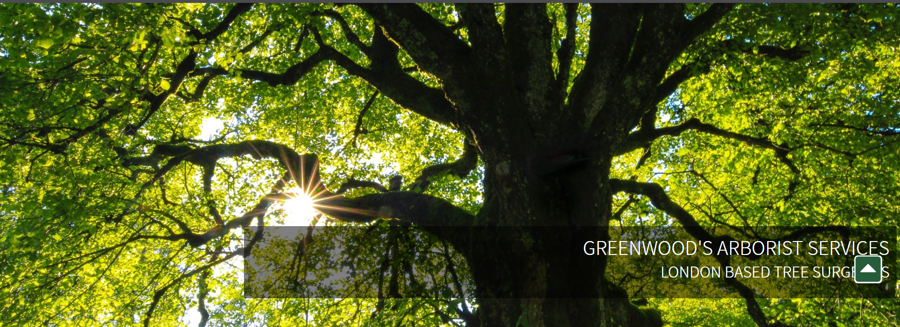

### About Us Section

- The About Us section gives the users a little bit of background on who the company are and how they started up.

- It also includes a map of the areas that the company works in.

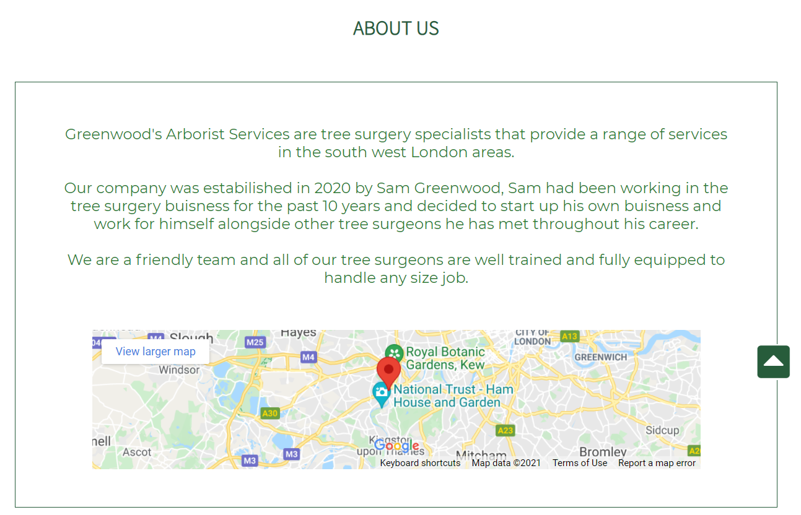

### Meet The Team Section

- This section is especially important for making customers feel comfortable inviting workers into their homes. A large majority of Greenwoods Arborist Services customers are age 70+ and no longer want to or are able to take care of their gardens themselves, it is important that the customer can see who they are inviting into their homes to make it a more relaxing experience. 

- This section will include a description of each staff member and what they do for the company.

- An image of the staff member is also included so the customers know who to expect.

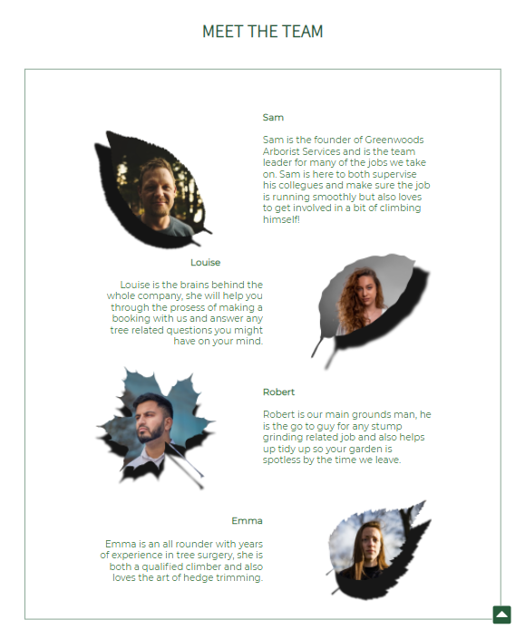

### Gallery Section

- The Gallery will provide the user with images that show what their work looks like.

- This section can help customers make a quicker decision on if this is the company they want to go with. 

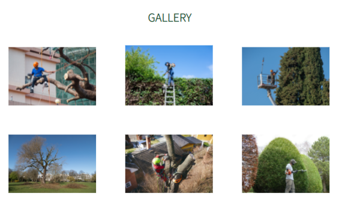

### Services Page

- Each section on the services page has a short description of what the service is.

- These descriptions come alongside an image of the service to make it easier and faster for customers to identify which service it is that they require.

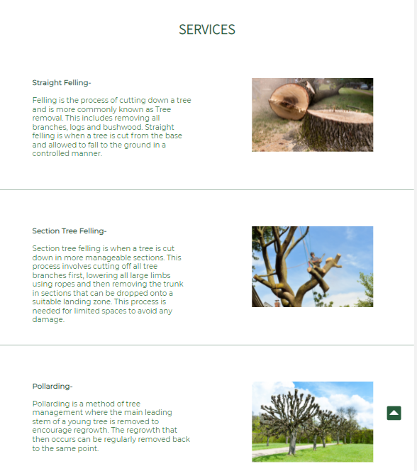

### Contact Us Page

- The contact us page has the company’s information (email address and phone number) if the user would like to talk directly to a member of staff.

- The page also includes a form that enables the user to leave a message for client. This form allows the user to leave a description of their request but also takes certain information to allow the client to get in contact via either email or phone with the user to answer any questions.

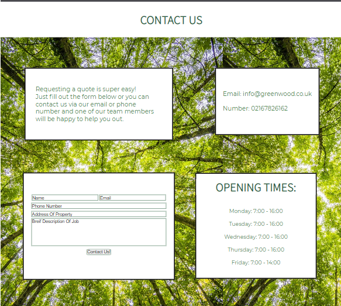

### Footer

- The footer includes important documentation like the terms and conditions of their services.

- The footer also has the companies email and phone number so that their contact information can be found easily on and page on the site. 

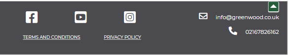

## Extra Features 

### Nav bar on mobile version

- the navigation bar is set out slightly differently depending on which size screen you are using, this is to allow the font size to be large enough for users to read.

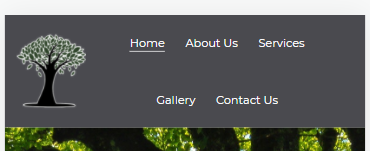

### Video

- I added a video in the gallery section to allow the user to engage more. 

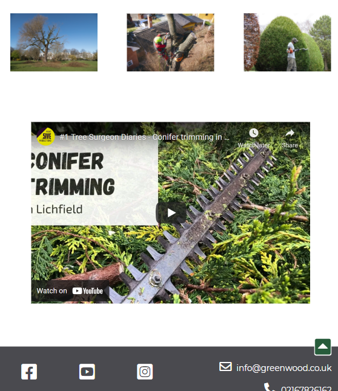

## Testing

### HTML

HTML was tested using the official [W3C validator](https://validator.w3.org/nu/) 

The following errors/warnings were found:

 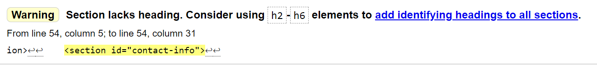

 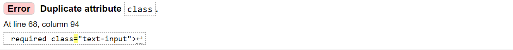

 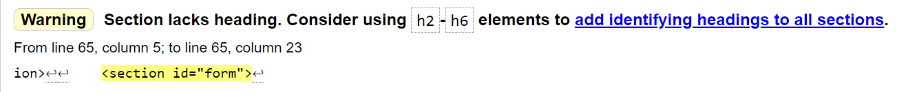

  1. contact information heading missing.
     - A heading was not needed so I changed the contact information section into a div inside 
       a main section on the contact us page.

Retested: Warning cleared

  2. Two classes were entered separately into the input elements in the form div.
     - I added the second class into the first as two were not needed. 
     - Originally it  looked like: class="form-input" class="text-input"
     - Now looks like: class="form-input text-input"

Retested: Error passed

  3. form heading missing 
     - A heading was not needed so I changed the form section into a div inside a main section on the contact us page.

Retested: Warning cleared

The HTML was then re-tested, and results came back with no errors.

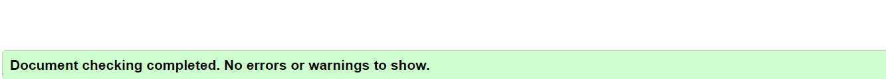

### CSS
 
 CSS was tested using the official [(Jigsaw) validator](https://jigsaw.w3.org/css-validator/)
 

 One error was found:

 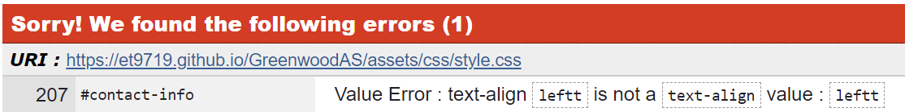

  1. Miss spelling of the word left as a value for text-align. 
     -corrected spelling.

  Retested: Error Passed

  The CSS was then re-tested, and results came back with no errors.

   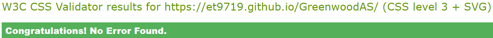  

### Manual Testing 

Component | Function | Does it work? | Fixed? 
--------- | --------- | ----------------- | ------ |
Logo | Takes user to home page | Yes | N/A
Navbar: Home | Takes user to home page | Yes | N/A
Navbar: About Us | Takes user to about us section | Yes | N/A

 ## Deployment

 The site was deployed to GitHub pages.

The steps to deploy are as follows:

- First, I created a new repository by clicking new in the GitHub repository menu
- I used the Code-institute-Org/gitpod-full-template and created a repository name.
- I continued by clicking in the create repository button at the bottom of the page.
- When it had been created I then went to settings.
- Scrolled down to Github pages where it says "Pages settings now has its own dedicated tab! Check it out here!" And I followed the link.
- When on Github pages I selected the source to be the main branch and pressed save.
- A message then pops up that says " Your site is ready to be published at  Your site is published at https://et9719.github.io/GreenwoodAS/" and when clicked on will take you to the site. 

 ## Credits

 ### Content

1. https://color.adobe.com/create/color-wheel : I used this site to help me choose the colors for the text on my site.

2. https://www.w3schools.com/ : I used this to help me when adding a map in the about us section and the video in the gallery section.

3. https://www.codingnepalweb.com/scroll-to-top-button-html-css/ : This site was used to help create the scroll to top button. 

4. https://www.graftingardeners.co.uk/tree-surgery-services-london/ : Thia site was inspiration for the descriptions of each service in the services section.

5. https://gitpod.io/workspaces and https://github.com/ : were used to create the site

6. https://stackoverflow.com/questions/31363971/github-pages-background-image-not-showing-up :
   I had a bit of trouble with the background image on my contact us page. It would show when opened in Gitpod but would not push to Gut hub. All i had to do was change the image path.

    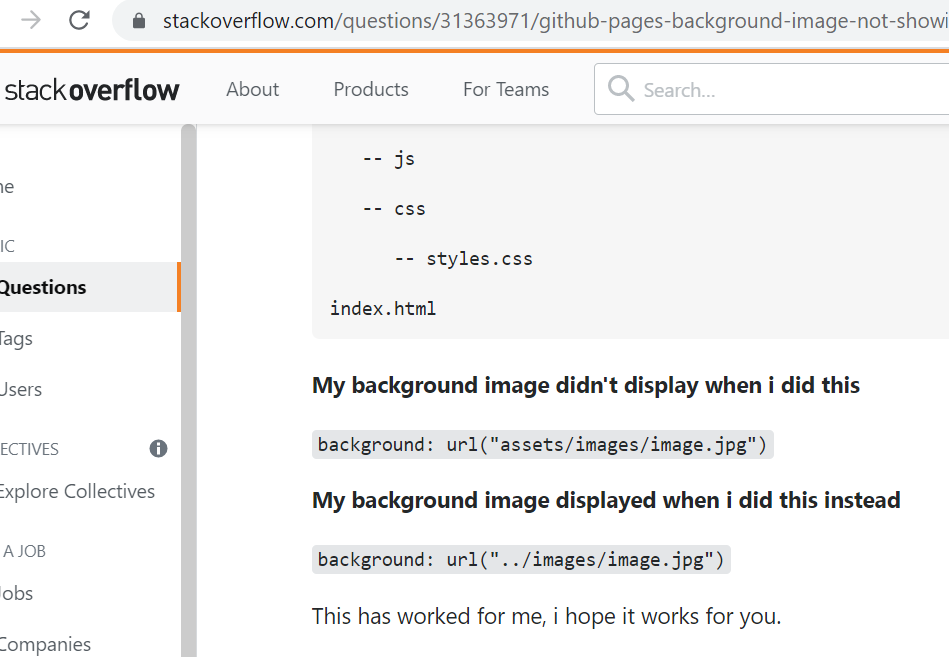  

 ### Media

1. Balsamiq Wireframes: This was used to create the wireframes used to design the site.

2. Procreate: I used this programme to edit the images for the meet the team section.

3. https://stock.adobe.com/ : I found my images for the Gallery and Services sections.

4. https://unsplash.com/ : I found the images for the landing page image and team members. 

